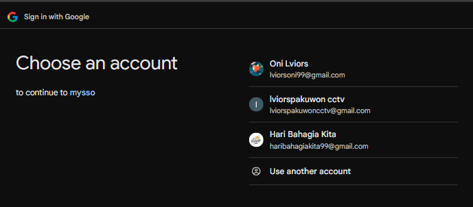
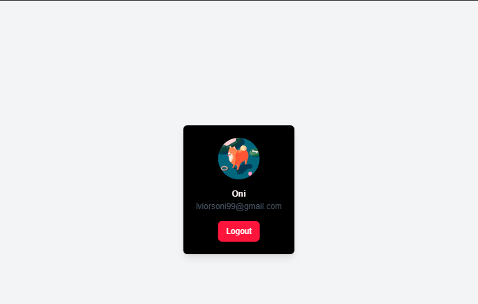
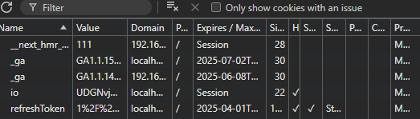

# Single Sign-On (SSO) with Next
### 📌 Overview
This project is a frontend implementation of Single Sign-On (SSO) authentication using Next.js. It allows users to authenticate using Google OAuth and manage session persistence via HTTP-only cookies.
### 🛠️ Technologies Used
- Next.js - React framework for frontend development
- Tailwind CSS - Styling framework
- fetch API - To interact with the backend
- OAuth 2.0 - Authentication via Google
### 🚀 Installation & Setup
#### FrontEnd (NextJS)
```bash
$ git clone https://github.com/oniauliya99/next-google-sso.git
$ cd next-google-sso

# Install dependencies
pnpm install

# Set up environment variables (.env)
NEXT_PUBLIC_API_URL=http://localhost:3000
NEXT_PUBLIC_GOOGLE_CLIENT_ID=your_google_client_id

# Start the server
pnpm dev
```
### 🔐 Authentication Flow
1. The user clicks the Sign in with Google button.
2. The frontend redirects the user to /auth/google.
3. Google handles authentication and redirects back to /auth/google/redirect.
4. The backend issues an access token and stores a refresh token in an HTTP-only cookie.
5. The frontend receives the token and stores it in localStorage.
6. The user can access protected routes using the token.

### 📜 API Endpoints
| Method | Endpoint                  | Description                |
|--------|---------------------------|----------------------------|
| **GET** | `/auth/google`            | Redirect to Google OAuth   |
| **GET** | `/auth/google/redirect`   | Google OAuth callback      |
| **POST** | `/auth/refresh-token`     | Refresh expired access token |
| **POST** | `/auth/logout`            | Log out and clear cookies  |
| **GET** | `/auth/protected`   | Checks if the request contains a valid authentication token      |
| **GET** | `/users/me`            | Get the logged-in user details   |

### 🖼️ Screenshots
- Login With Google
  

- Redirect Login
  

- Dashboard 
  
  
- Refresh Token On Cookie


### 📌 Notes
- Make sure to replace your_google_client_id and your_google_client_secret in .env.
